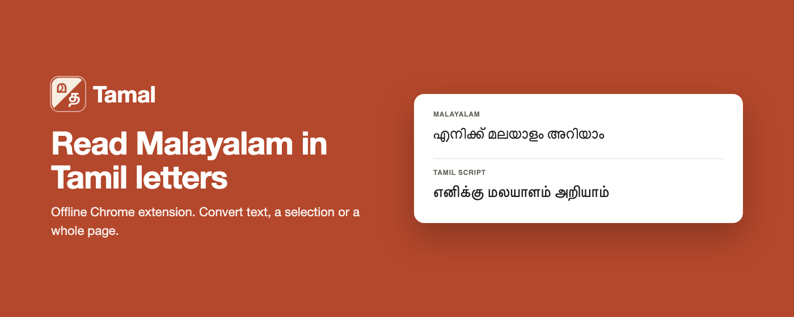
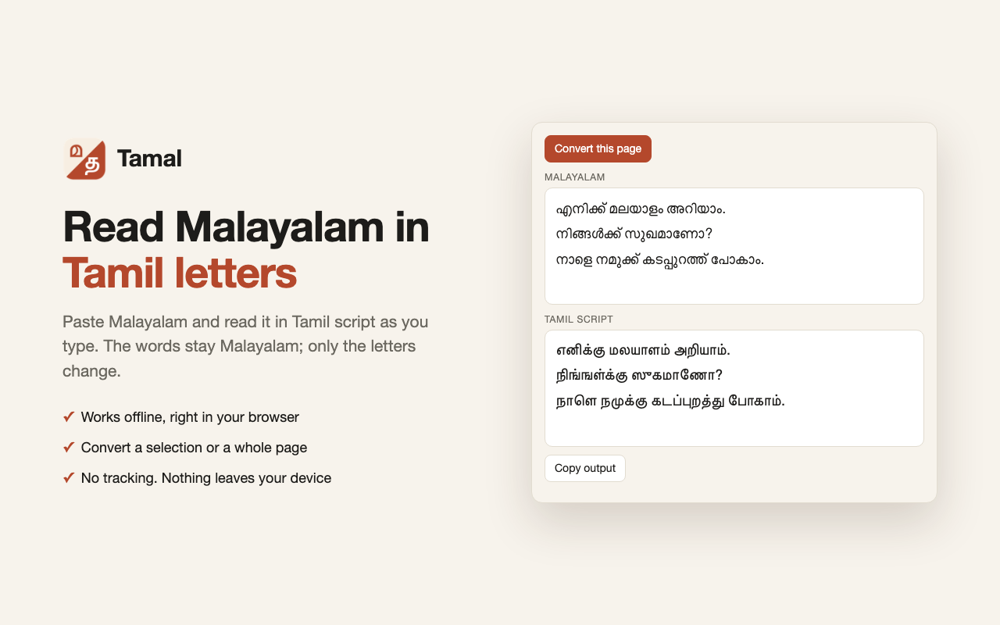
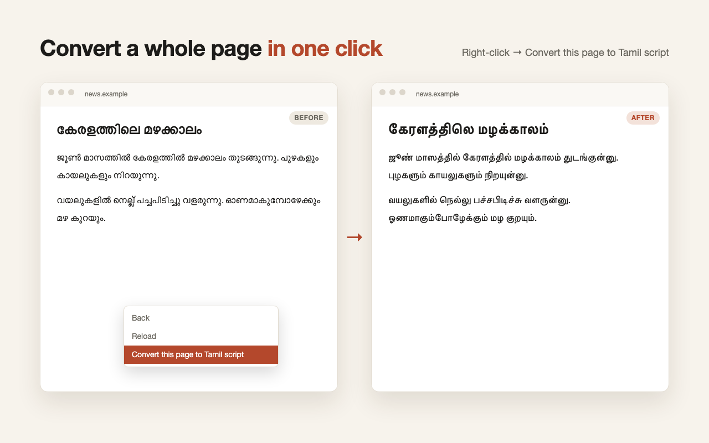

<p align="center">
  
</p>

# Tamal



Read Malayalam in Tamil letters. Tamal keeps the Malayalam words and only changes the
script, for readers who know Tamil script but not Malayalam script:

```
എനിക്ക് മലയാളം അറിയാം  →  எனிக்கு மலயாளம் அறியாம்
```

Everything runs locally. There is no server, no network access and no data collection.

## Chrome extension

`extension/` is an unpacked MV3 extension. To install: `chrome://extensions` → Developer
mode → **Load unpacked** → pick `extension/`.

- **Popup**: paste Malayalam and read the Tamil-script output live, or click *Convert this page*.
- **Right-click a selection** → *Show selection in Tamil script*: the result shows in a small corner panel.
- **Right-click the page** → *Convert this page to Tamil script*: text that loads later is converted too.

It asks only for `activeTab`, `scripting` and `contextMenus`. It runs on a page only when
you click the popup button or a menu item, so it needs no access to all sites.

| Popup | Whole page |
|---|---|
|  |  |

## Web page

`site/` is a one-page converter for phones and other browsers, published with GitHub Pages at
https://babu.work/tamal/ by `.github/workflows/pages.yml` on every push to `main`.
`make site` assembles it into `dist/site/` with the same `tamal.js` the extension uses.

## CLI

```sh
npm link                            # once: puts `tamal` on PATH
echo "എന്റെ പേര്" | tamal           # என்டெ பேரு
tamal notes.txt > notes.tamil.txt
```

## How the conversion works

Most letters map one to one, because the Malayalam and Tamil Unicode blocks share a layout.
Tamil has fewer letters, so some information is lost:

- **Voicing and aspiration**: ക ഖ ഗ ഘ all become க, and പ ബ ഭ all become ப (`ഭാരതം` → `பாரதம்`).
- **ഫ** becomes ஃப, the Tamil spelling of "f" (`ഫോൺ` → `ஃபோண்`).
- **ന** becomes ந at the start of a word and before த (`പന്ത്` → `பந்து`), and ன elsewhere (`എന്ന` → `என்ன`).
- **Word-final ്** (the half-u) is written ு, the way it is pronounced (`അത്` → `அது`).
- **ം** becomes the nasal that matches the next consonant (`സംഗീതം` → `ஸங்கீதம்`), and ம் otherwise.
- **Double letters that Tamil doesn't use** get the usual Tamil spelling: ങ്ങ → ங்க (`ഇറങ്ങി` → `இறங்கி`), ഞ്ഞ → ஞ்ச (`കുഞ്ഞ്` → `குஞ்சு`), റ്റ → ட்ட (`ടിക്കറ്റ്` → `டிக்கட்டு`), ന്റ → ன்ட (`എന്റെ` → `என்டெ`). And **ശ** is written ஷ (`ആശുപത്രി` → `ஆஷுபத்ரி`).
- **The au sign ൗ**, written alone in modern spelling, becomes ௌ (`കൗതുകം` → `கௌதுகம்`).
- **Chillus** become consonant + pulli (`അവൻ` → `அவன்`), including the older ZWJ spelling.
- **ൃ** becomes ்ரு (`കൃഷ്ണൻ` → `க்ருஷ்ணன்`), and ശ്രീ becomes ஸ்ரீ.
- **Malayalam digits** become 0–9.

The converter is `extension/tamal.js`. The CLI and tests use the same file.

## Development

```sh
make test     # or: npm test
make zip      # runs the tests, then writes dist/tamal-<version>.zip for the Chrome Web Store
```

## Chrome Web Store

`store/` holds everything for the store listing:
- `listing.md` has the name, summary, descriptions (English and Tamil) and privacy-tab answers.
- `privacy.md` is the privacy policy, published at
  https://gist.github.com/babus/1100d37cd6fd2b9c5eca86edf1358f37.
- `make store` renders the screenshots and promo tiles from `store/src/*.html` with headless
  Chrome. They use the real converter, so re-run it after changing `tamal.js`.

The extension's name and summary are localized in `extension/_locales/` (English and Tamil).

## Releasing

CI (`.github/workflows/ci.yml`) runs the tests and builds the zip on every push and pull
request. To release:

1. Bump `version` in both `extension/manifest.json` and `package.json`. CI fails if they differ.
2. Commit, then tag and push: `git tag v0.2.0 && git push origin main v0.2.0`.
3. CI checks that the tag matches the manifest version, then publishes a GitHub Release
   with `tamal-<version>.zip` attached. Upload that zip to the Chrome Web Store.

## License

MIT. See `LICENSE`.
